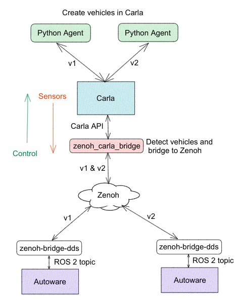

## Architecture:


## Docker installation:
https://docs.docker.com/engine/install/ubuntu/

```bash
# Add Docker's official GPG key:
sudo apt-get update
sudo apt-get install ca-certificates curl
sudo install -m 0755 -d /etc/apt/keyrings
sudo curl -fsSL https://download.docker.com/linux/ubuntu/gpg -o /etc/apt/keyrings/docker.asc
sudo chmod a+r /etc/apt/keyrings/docker.asc

# Add the repository to Apt sources:
echo \
  "deb [arch=$(dpkg --print-architecture) signed-by=/etc/apt/keyrings/docker.asc] https://download.docker.com/linux/ubuntu \
  $(. /etc/os-release && echo "$VERSION_CODENAME") stable" | \
  sudo tee /etc/apt/sources.list.d/docker.list > /dev/null

sudo apt-get update
sudo apt-get install docker-ce docker-ce-cli containerd.io docker-buildx-plugin docker-compose-plugin

```

## Building the containers:
```bash
git clone https://github.com/evshary/autoware_carla_launch

# Carla Bridge container   [Terminal 1]
./container/run-bridge-docker.sh
cd autoware_carla_launch
source env.sh
make prepare_bridge 
make build_bridge

# Zenoh Autoware Container [Terminal 2]
./container/run-autoware-docker.sh
cd autoware_carla_launch
source env.sh
make prepare_autoware
make build_autoware
```

## Run Carla sim :

```bash
 wget https://carla-releases.b-cdn.net/Linux/CARLA_0.9.15.tar.gz
 
 mkdir carlasim
 
 mv CARLA_0.9.15.tar.gz carlasim/.
 
 cd carlasim/
 
 tar -xvf CARLA_0.9.15.tar.gz 
 rm CARLA_0.9.15.tar.gz 
 
 ./ImportAssets.sh 
 
./CarlaUE4.sh -quality-level=Epic -world-port=2000 -RenderOffScreen
 
```
## Running the Zenoh_carla_bridge and Python agent

```bash
[Terminal 1]
./script/run-bridge.sh

[Terminal 2]
./script/run-autoware.sh
```

## RVizz setup:

### Change the View to TPP by navigating to the panels section in the 
.png)

.png)

### Set up the path use the 2D Goal Pose option
.png)

### Use the arrow head on the Autoware SIM to set the path
.png)
### Keep extending the path with small extension
.png)
.png)
